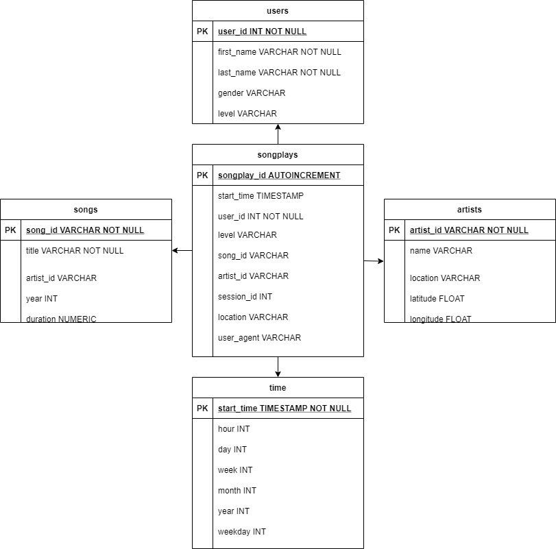

# Data Modeling with Postgres

## Introduction

A music streaming startup, Sparkify, has grown their user base and song database and want to move their processes and data onto the cloud. Their data resides in S3, in a directory of JSON logs on user activity on the app, as well as a directory with JSON metadata on the songs in their app.

As their data engineer, you are tasked with building an ETL pipeline that extracts their data from S3, stages them in Redshift, and transforms data into a set of dimensional tables for their analytics team to continue finding insights in what songs their users are listening to. You'll be able to test your database and ETL pipeline by running queries given to you by the analytics team from Sparkify and compare your results with their expected results.


## Data Model 

This project use a single fact table to store measure data *(songplays)* and few dimension tables to store some attributes about data.



**songplays** --> records in log data associated with song plays i.e. records with page ```NextSong```.

**users** --> users in the app.

**songs** --> songs in music database.

**artists** --> artists in music database.

**time** --> timestamps of records in **songplays** broken down into specific units.


## ETL Pipeline

There are few steps to run in order to insert data into the tables.

**sql_queries.py** : DDL to create the structure of the database and DML to insert and manipulate data in the database.

**create_tables.py** : establishes the connection to the sparkify database in a Redshift cluster (AWS) and call the previous step. The cluster was created before as Iac with the notebook ```create_redshift_cluster.ipynb```

**etl.py** : read, transform and load data into the new database using a staging area where the files stored in S3 were COPY into Redshift.


## Example Queries

Some queries were executed to test the connection and check if the database is available and running, few examples are in the notebook ```querying_redshift_cluster.ipynb```

## Hints

Doing the project some important point were found and I'like to share them:

1. The best way to load a big amount of data into redshift is using the COPY command, for this project was used  **COPY from JSON format** and sometime you have to indicate the JSON structure of the file in the COPY. To see more documentation: [COPY from JSON format](https://docs.aws.amazon.com/redshift/latest/dg/copy-usage_notes-copy-from-json.html)

2. Another good point about redshift COPY command is that it can be parametrized, for example TIMESTAMP columns can be formatted as ```TIMEFORMAT [AS] {'timeformat_string' | 'auto' | 'epochsecs' | 'epochmillisecs' }```. To see more documentation:
 [Data conversion parameters](https://docs.aws.amazon.com/redshift/latest/dg/copy-parameters-data-conversion.html#copy-timeformat)

3. To reduce the timming to read **song_data** I chose a group of file following the S3 link ```'s3://udacity-dend/song_data/A/A'```

4. Before to create a new IAM role, you must create a new IAM user in your AWS account, give it **AdministratorAccess** from Attach existing policies directly tab and take note of the access key and secret

5. To insert data into the final tables some columns were formatted using CAST function. To see documentation: [CAST and CONVERT functions](https://docs.aws.amazon.com/redshift/latest/dg/r_CAST_function.html)